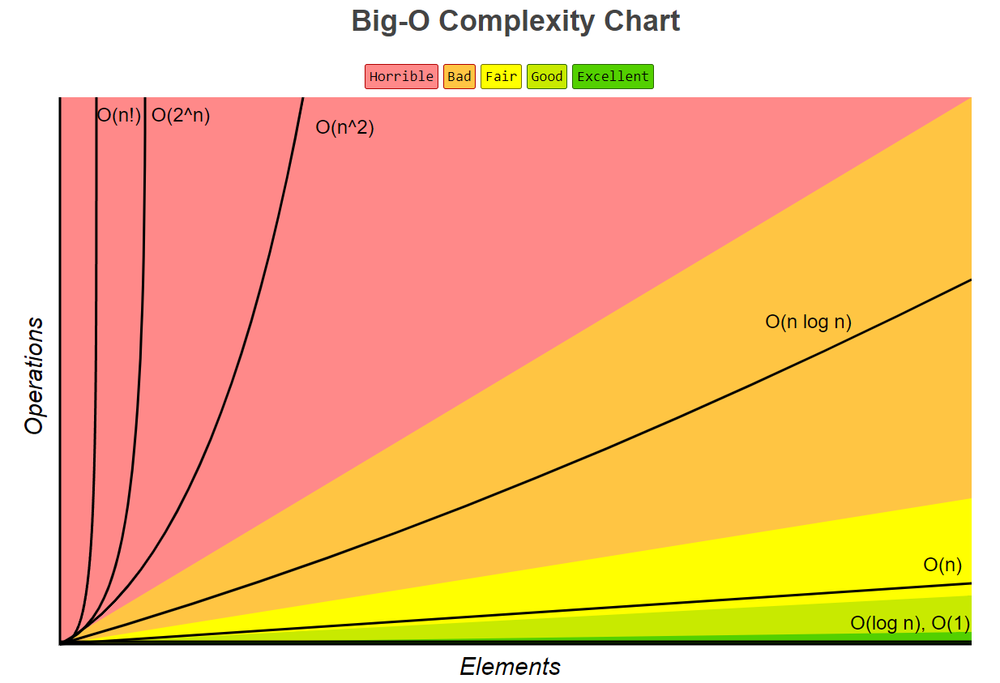

# Chapter 7 - Intermediate I

:tulip: :cherry_blossom:

* I. [Algorithm & Analysis](#1-ac)
  * I-I. [O Notation](#1a)
  * I-II. [Ω Notation](#1b)
  * I-III. [Θ Notation](#1c)
  * I-IV. [Complexity Analysis](#1d)
* II. [Coding Example - Analysis](#2-ca)
* III. [Q & A](#3-qa)

<h2 id="1-ac">I. Algorithm & Analysis</h2>

**Algorithm**, is a step-by-step set of instructions or a well-defined procedure for solving a particular problem or accomplishing a specific task.

<h3 id="1a">O Notation [Compulsory]</h3>

**Big O notation**, represents the **upper** bound or **worst-case** time complexity of an algorithm. It provides an upper limit on the number of operations an algorithm will take as a function of its input size.

<h3 id="1b">Ω Notation - [Optional]</h3>

**Omega notation**, represents the **lower** bound or **best-case** time complexity of an algorithm. It provides a lower limit on the number of operations an algorithm will take as a function of its input size.

<h3 id="1c">Θ Notation - [Optional]</h3>

**Theta notation**, represents **BOTH** the upper and lower bounds of an algorithm's time complexity. It provides a tight range within which the actual number of operations will fall as a function of its input size.

<h3 id="1d">O Notation - Complexity Chart [Compulsory]</h3>

| Complexity    | Name              | Description                                                               |
|---------------|-------------------|---------------------------------------------------------------------------|
| $O(1)$        | Constant Time     | Time complexity remains constant regardless of input size.                |
| $O(log n)$    | Logarithmic Time  | Time complexity grows logarithmically as input size increases.            |
| $O(\sqrt{n})$ | Square Root Time  | Time complexity grows proportionally to the square root of input size.    |
| $O(n)$        | Linear Time       | Time complexity grows linearly with input size.                           |
| $O(nlog n)$   | Linearithmic Time | Time complexity grows linearithmically (n log n) as input size increases. |
| $O(n^{2})$    | Quadratic Time    | Time complexity grows quadratically with input size.                      |
| $O(n^{3})$    | Cubic Time        | Time complexity grows cubically with input size.                          |
| $O(2^{n})$    | Exponential       | Time complexity grows exponentially with input size.                      |
| $O(n!)$       | Factorial Time    | Time complexity grows factorially with input size.                        |



:pencil: We can assume that `Elements` is inputs, and `Operations` is amount of time that has been used.

By comparing $O(log n)$ and $O(n^{2})$, suppose 1 element needs 1 second of operation. 

* There're two different programs that have the same input $x=4$. The time for $O(log n)$ would be $log 4$ seconds (approximate $0.6020$), while the $O(n^{2})$ one would be $4^{2}$ which is $16$ seconds.
* There're two different programs that have the same input $x=5$. The time for $O(log n)$ would be $log 5$ seconds (approximate $0.6989$), while the $O(n^{5})$ one would be $5^{2}$ which is $25$ seconds.

As you can the rate of $O(n^{2})$ is apparently higher than the $O(log n)$ one, that's why the complexity of $O(n^{2})$ is considered as *Horrible*.

<h2 id="2-ca">II. Coding Example - Analysis</h2>

:raising_hand: Before reading this session, make sure you have accomplished the reading of `O notation` and `Algorithm analysis` chapters on Zybook.

> How do we actually analyse the complextiy of some code?

:zap: Variant 1

```
for (int i = 0; i < 10; i++) {
    System.out.println("Current: " + i); // 1 operation
    System.out.println("Iterating...*"); // 1 operation
}
```

Firstly, inside the `for-loop`, there would be many operations but in this case, we have totally $2$ operations only. Therefore, for the scope of `for-loop` inside, the complexity is $O(2)$.

Secondly, for the whole scope of `for-loop`, it will iterate totally $10$ times (because it starts from index $0$, and $i$ is less than $10$, so everytime you see them if you're wondering how many loops its gonna be, just focus on the $10$, $10$ times). Meanwhile, since the complexity $O(2)$ is inside of the $10$ times `for-loop`, we normally just pay attention to the outside one, whose complexity is $O(10)$.

:zap: Variant 2

```
for (int i = 0; i <= 10; i++) {
    System.out.println("Current: " + i); // 1 operation
    System.out.println("Iterating...*"); // 1 operation
}
```

This time, the `<` has been changed to `<=`, which includes index $10$. Totally $11$ times, $O(11)$.

:zap: Variant 3

```
for (int i = 1; i < 10; i++) {
    System.out.println("Current: " + i); // 1 operation
    System.out.println("Iterating...*"); // 1 operation
}
```

Now $i$ is changed to and starts from $1$. Totally $9$ times, $O(9)$.

So be careful with the iterating index variable and the condition.

:zap: Variant 4

```
Scanner scnr = new Scanner(System.in);
ArrayList<Integer> numList = new ArrayList<Integer>();
bool isRunning = false;

while (!isRunning)


for (int i = 1; i < 10; i++) {
    System.out.println("Current: " + i); // 1 operation
    System.out.println("Iterating...*"); // 1 operation
}
```

<h2 id="3-qa">III. Q & A</h2>

Q1: Waiting~

A1: Waiting for the Q1's Waiting~

